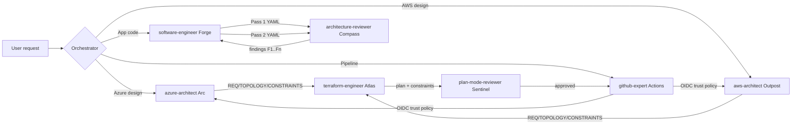

# Agentic AI Demo — Wiki

Multi-agent IaC engineering team for **Claude Code** and **GitHub Copilot**.

## Pages

| Page | What's in it |
|---|---|
| [01 — Setup: Claude Code](01-Setup-Claude.md) | Install, drag-and-drop, verification in the Agents center |
| [02 — Setup: GitHub Copilot](02-Setup-Copilot.md) | Install, drag-and-drop, verification in the Agent picker |
| [03 — Test Prompts L1](03-Test-Prompts-L1.md) | Simple single-agent prompts + expected outcomes |
| [04 — Test Prompts L2](04-Test-Prompts-L2.md) | Multi-agent handoff prompts + expected outcomes |
| [05 — Test Prompts L3](05-Test-Prompts-L3.md) | Full-ecosystem tests exercising all agents & skills |
| [06 — Adding Agents & Skills](06-Adding-Agents-and-Skills.md) | Templates and conventions for growing the roster |

## The flow at a glance

**Gates (non-optional):** every Terraform plan passes Sentinel before apply; every implementation passes Compass (max 2 passes); reviewers never write code.
